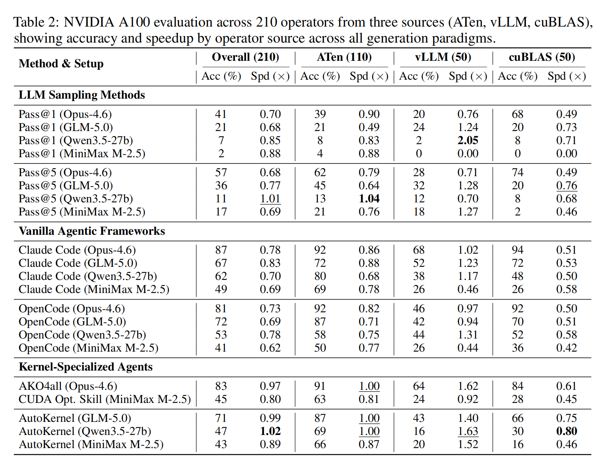
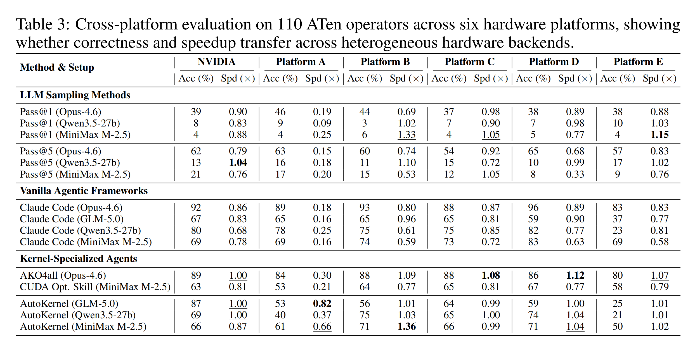

[](https://flagos.io/)

[[中文版](./README.zh-CN.md)|English]

<div align="right">
  <a href="https://www.linkedin.com/company/flagos-community" target="_blank">
    
  </a>

  <a href="https://www.youtube.com/@FlagOS_Official" target="_blank">
    
  </a>

  <a href="https://x.com/FlagOS_Official" target="_blank">
    
  </a>

  <a href="https://www.facebook.com/flagosglobalcommunity" target="_blank">
    
  </a>

  <a href="https://discord.com/invite/ubqGuFMTNE" target="_blank">
    
  </a>
</div>

## Overview

KernelGenBench is a component of [FlagOS](https://flagos.io/) — a unified, open-source AI system software stack. It is a benchmark framework for evaluating LLM and agent-based Triton kernel generation across multiple hardware platforms.

## Features

- **210 operators** across three sources: ATen (110), vLLM (50), cuBLAS (50)
- **Multi-chip support**: NVIDIA, Ascend NPU, MUSA, Hygon DCU, Iluvatar, MetaX
- **Two evaluation tracks**: LLM Track (Pass@K) and Agent Track (iterative generation)
- **Multiple agent methods**: Claude Code, OpenCode, AutoKernel, AKO4ALL
- **Automatic verification**: accuracy testing with three-tier anti-hack mechanism

### NVIDIA

```bash
git clone https://github.com/flagos-ai/KernelGenBench.git
cd KernelGenBench
pip install -r requirements/requirements_nvidia.txt
pip install -e .
```

> `vllm==0.13.0` will automatically install compatible versions of torch and triton.

### Domestic Chips (Ascend / MUSA / Hygon / Iluvatar / MetaX)

On domestic chips, torch and the chip-specific runtime (e.g., torch_npu, torch_musa) are pre-installed in the vendor container image. Use the vendor-provided Docker image to start a container, then install KernelGenBench inside it:

```bash
# Start the vendor container (example for Ascend NPU)
docker run -it --rm --network host \
    --device=/dev/davinci0 --device=/dev/davinci_manager \
    ascend/pytorch:latest bash

# Inside the container, clone and install
git clone https://github.com/flagos-ai/KernelGenBench.git
cd KernelGenBench
pip install -r requirements/requirements_ascend.txt
pip install -e .

# For other chips, replace the requirements file:
#   Hygon DCU:  requirements/requirements_hygon.txt
#   MUSA:       requirements/requirements_musa.txt
#   Iluvatar:   requirements/requirements_iluvatar.txt
#   MetaX:      requirements/requirements_metax.txt
```

> **Note**: Do NOT install vllm on non-NVIDIA platforms — it is NVIDIA-only.

Configure API credentials:

```bash
# Anthropic Claude
export ANTHROPIC_API_KEY=your_key

# OpenAI / OpenAI-compatible
export OPENAI_API_KEY=your_key
export OPENAI_BASE_URL=http://your-endpoint/v1  # optional, for custom endpoints
```

> **For Agent Track**, also install Claude Code CLI:
> ```bash
> npm install -g @anthropic-ai/claude-code
> ```

## Datasets

| Dataset | Operators | Description |
|---------|-----------|-------------|
| `KernelGenBench` | 210 | Full set (ATen + vLLM + cuBLAS, NVIDIA-only) |
| `KernelGenBench-aten` | 110 | ATen operators only |
| `KernelGenBench-vllm` | 50 | vLLM operators only (NVIDIA-only) |
| `KernelGenBench-cublas` | 50 | cuBLAS operators only (NVIDIA-only) |

On non-NVIDIA chips, the default dataset is automatically set to `KernelGenBench-aten` (vLLM and cuBLAS operators require NVIDIA GPUs).

## Supported Devices

KernelGenBench supports 6 hardware platforms: NVIDIA, Ascend, MUSA, Hygon, Iluvatar, MetaX.

Device type is auto-detected. All platforms use the same commands — the framework handles device differences automatically.

## Results

### Multi-Source (NVIDIA A100, 210 operators)

Evaluation across 210 operators from three sources (ATen, vLLM, cuBLAS), showing accuracy and speedup by operator source across all generation paradigms.



### Multi-Chip (110 ATen operators, 6 platforms)

Cross-platform evaluation on 110 ATen operators across six hardware platforms, showing whether correctness and speedup transfer across heterogeneous hardware backends. Platforms A–E are anonymized vendor hardware.




*Generating Triton kernels on non-NVIDIA hardware incurs significant additional cost — up to 2× more tokens and time due to immature compilers and incomplete backend support.*

## LLM Track

Evaluate an LLM on generating Triton kernels with Pass@K metric:

```bash
# Single operator test
python scripts/generate_kernel_and_verify.py \
    --op-name aten::add \
    --single-test \
    --server-type openai \
    --model-name gpt-4o
```

## Documentation

📚 **Full documentation available at [docs/source/](docs/source/)**

| Section | Description |
|---------|-------------|
| [Overview](docs/source/overview/index.md) | What is KernelGenBench and why use it |
| [Getting Started](docs/source/getting-started/index.md) | Installation and first benchmark |
| [LLM Track](docs/source/operation-guide/llm-track/index.md) | Pass@K evaluation guide |
| [Agent Track](docs/source/operation-guide/agent-track/index.md) | Agent-based evaluation guide |
| [Reference](docs/source/reference/index.md) | Datasets, operators, hardware |
| [FAQ](docs/source/faq/index.md) | Common questions |

## Citation

```bibtex
@software{kernelgenbench2026,
  title={KernelGenBench: A Benchmark for LLM and Agent-Based Triton Kernel Generation},
  author={KernelGen Team},
  url={https://github.com/flagos-ai/KernelGenBench},
  year={2026}
}
```

## License

This project is licensed under the Apache 2.0 License.
